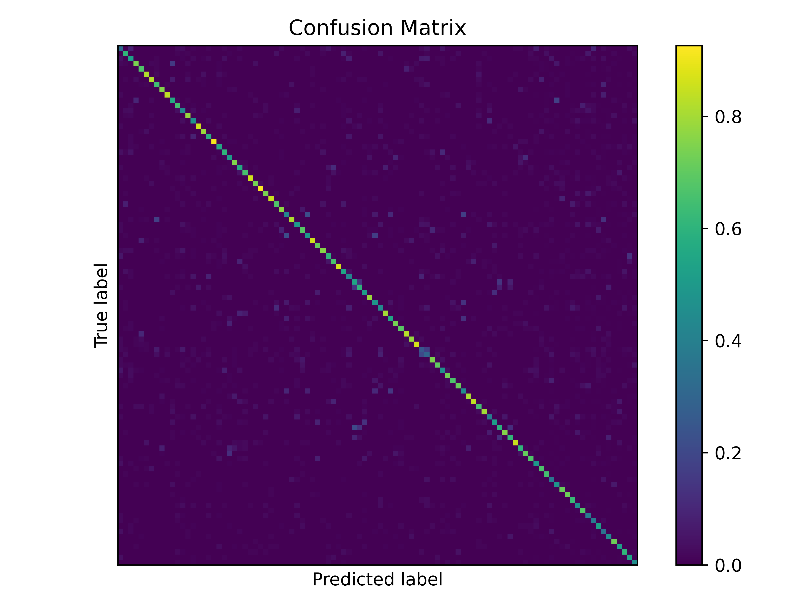
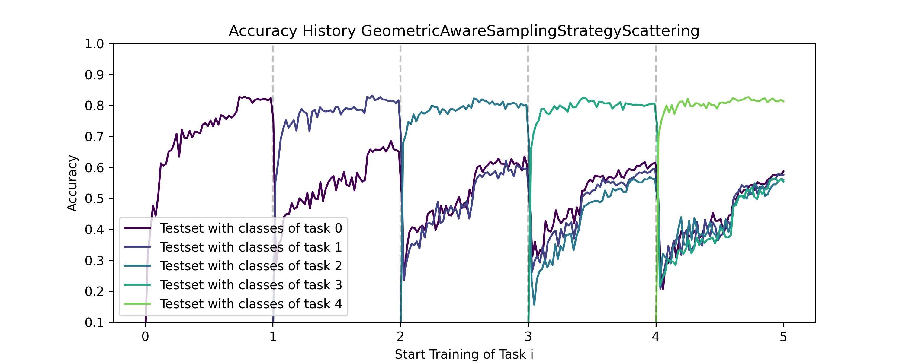
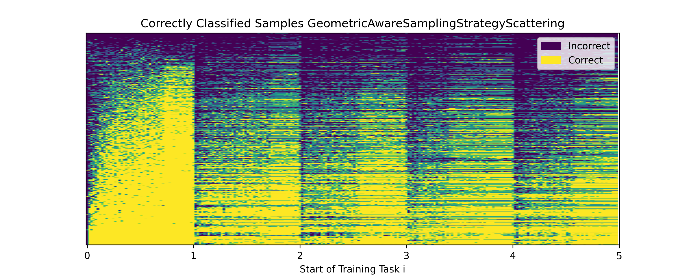
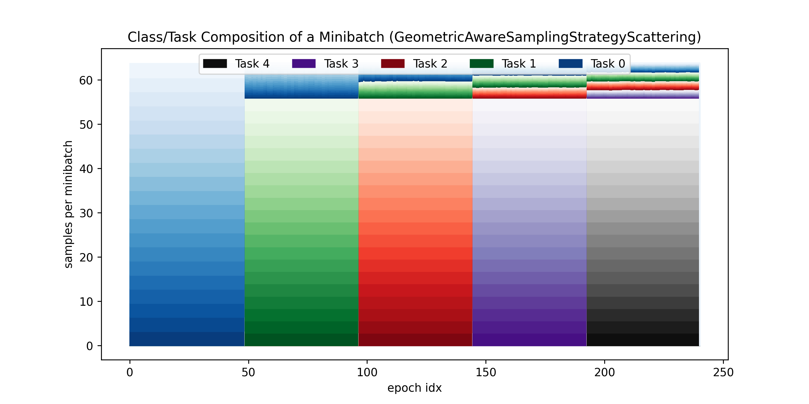

# Prototype-Based Sampling for Class-Incremental Learning

## Reproduce the Experiments

1) Clone the repository
2) Install the requirements
   ```bash
   # create and activate a virtual environment
   python3 -m venv .venv
   source .venv/bin/activate
   
   # install the requirements
   pip install -r requirements.txt
   ```

3) Run the experiments
   ```bash
    # run the experiments
    python main.py
    ```

We are using Python 3.12 for this project.

## Hyperparameters

Inside `main.py`, you find multiple parameters you can tweak to select which experiments get executed what dataset is
used. Essential hyperparameters such as `batch_size`, `number of tasks` etc. can also be tuned directly within
`main.py`.

Additional experiment-specific hyperparameters can be found in the corresponding experiment classes. Essential
hyperparameters that are shared across all experiments can be found on `experiments/base_experiment.py`. Here
the `lr`, optimizer, ... are defined and can be changed.

## Results

The results are stored in the `tb_data` directory. You can visualize them using tensorboard.

```bash
tensorboard --logdir tb_data --port 6066
```

Open tensorboard in your browser at `localhost:6066`. Now, you should be able to see all the results and plots used in
the paper.

### Regenerate Result Figures from Data

All metrics returned are saved inside a `.pkl` file. You can regenerate the figures using
the following command:

```bash
python main.py --res_path tb_data/<date-of-run>_results
```

The results are then saved inside a tensorboard directory. You can visualize them using tensorboard.

```bash
tensorboard --logdir tb_data/<date-of-run>_results --port 6066
```

### Figures Generated By the Code

For debugging purposes, we generate some figures all of which are added to the tensorboard. We show and explain some of
them. Note the following figures are not part of the paper and may not represent the final results described in the
report but rather are chosen to explain their purpose during development.

1) **Confusion Matrix** We plot the confusion matrix for the current model.
   

2) **Accuracy** We plot the accuracy of the test set of all tasks.
   

3) **Slow Learners** We plot the slow learners of the model. This figure is recreated based on the "Forgetting Order of
   Continual Learning: Examples That are Learned First are Forgotten Last" paper (figure 2 (b))
   

4) **Composition of Mini-Batches** To check the composition of the mini-batches, we plot the number of samples per class
   in each mini-batch. The figure shows the number of samples per class in each mini-batch.
   

5) **Composition of Mini-Batches (Unique Samples)** Similar to the previous figure, but we show the number of unique
   samples per class in each mini-batch.
   

## Development / Debugging

We use black for code formatting the code. You can install it using pip and run it on the code.

```bash
black .
```

Please run black before committing your changes. And configure your editor to run black on save.

### Short Introduction to Avalanche

[YouTube: Antonio Carta | "Avalanche: an End-to-End Library for Continual Learning"](https://www.youtube.com/watch?v=n6mykeLdeg0)
